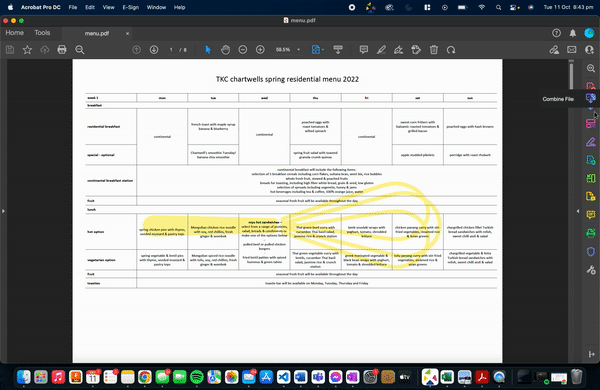

# BssrBot 3.2.2
> Basser's Dino Menu, Shop and Calendar Assistant

## Requirements

Wit.ai - Language process
Heroku - Hosting code
NewRelic https://elements.heroku.com/addons/newrelic - Prevents code from idling
Database: postgresql - stores information input by users

## To Do
- Dino - done
- Shopen - done
- Add shop catalogue -done
- Calendar - Done
- Wildcat of the week nominations
- Add images
- Add quotes
- Wildcat nominations
- Ressies


## To Update menu
Before updating the menu create a new branch and move to it. (See Git documentation)

1. Convert menu to pdf and open in Adobe Acrobat.
2. Select 'Edit PDF' and delete watermark from all pages (1-8)



3. Save the menu as 'menu.html' into bssrbot directory.


4. In the bssrbot directory run the command:
```
$ python3 menu_to_df.py
```
If successful  there should be a menu week folder generated with the following terminal output. 


5. Determine what week of the four week cycle dino is on.
- This can be done by figuring out what meal on the menu corresponds to the meals eaten on the current day and then matching that to the week number located at the top of the page.

6. Then run the command
```
$ python3 check_week.py
```
This will output a week number. Edit the variable named 'WEEK_ADJUST_FACTOR' in the check_week.py file so that the output week matches that of the true current dino week.

7. Edit the 'WEEK_ADJUST_FACTOR' located in the 'bot_constants.py' file so that it matches the one determined in step 6.
8. Push the new menu to the remote branch.
9. Launch the development version of the bot on this branch.
10. Test the menu is correct.
11. Merge the branch into the main.
12. Ensure it builds correctly and functions as usual.

## To Update calendar

1. \copy data into db using heroku:
	\copy calendar FROM <path_to_calednar.csv> WITH (FORMAT CSV);
2. Go to calendar1 and zero week in getaway function
3. Push changes
### Formatting Calendar
- Make sure have a zero row at top with days in
- change nulls to blanks and then update line in calendar1

## Capabilities
- Return meal from Dino, breakfast, lunch and dinner
 	- including tomorrow and days of week
- Crack a joke
- Greetings
- Process pleasantries
- Get user's name
- Shopen
- Easter Eggs
- Shop catalogue
- Dinotimes
- Dino Feedback link
- Calendar
	- Week by week
	- Days
	- Week numbers
	- next week

## Work On
- calendar - IN PROGRESS
	add day by day
	add next week
	maybe add week number
- putting menu in db
- getting dessert

Github# bssrbot3